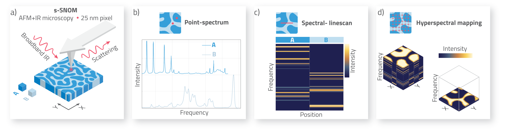

# Orange workflows for s-SNOM nanospectroscopy data processing

In this repository you find [Orange](https://orangedatamining.com) workflows for processing s-SNOM data. An example dataset including point spectra, spectral linescan and hyperspectral mapping is provided for educational purposes. All data provided was measured with synchrotron IR broadband light sources and are a courtesy of Feres *et al.* [1].

## Guidlines for downloading and oppening workflows:

1. Go to https://github.com/raul-freitas/imbuia_workflows
2. Click on **Code** and then **Download ZIP**. This can take some time...
3. You should get the following files structure:

```
├── README.md
├── dataset
│   ├── NF S REFERENCE linescan-hyp M2A raw.gsf
│   ├── NF S REFERENCE linescan-hyp M2P raw.gsf
│   ├── NF S REFERENCE linescan-hyp Spectra.txt
│   ├── NF S REFRENCE point-spectrum M2A raw.gsf
│   ├── NF S REFRENCE point-spectrum M2P raw.gsf
│   ├── NF S REFRENCE point-spectrum Spectra.txt
│   ├── NF S SAMPLE hyp M2A raw.gsf
│   ├── NF S SAMPLE hyp M2P raw.gsf
│   ├── NF S SAMPLE hyp Spectra.txt
│   ├── NF S SAMPLE linescan M2A raw.gsf
│   ├── NF S SAMPLE linescan M2P raw.gsf
│   ├── NF S SAMPLE linescan Spectra.txt
│   ├── NF S SAMPLE point-spectrum M2A raw.gsf
│   ├── NF S SAMPLE point-spectrum M2P raw.gsf
│   ├── NF S SAMPLE point-spectrum Spectra.txt
│   └── info.md
├── hyperspectral_map
│   ├── gsf_hyperspectral_workflow.ows
│   ├── info.md
│   └── txt_hyperspectral_workflow.ows
├── img
│   ├── info.md
│   └── nanospectroscopy_modes.svg
├── point_spectrum
│   ├── gsf_point_spectrum_workflow.ows
│   ├── info.md
│   └── txt_point_spectrum_workflow.ows
└── spectral_linescan
    ├── gsf_linescan_workflow.ows
    ├── info.md
    └── txt_linescan_workflow.ows

```
5. Open the Orange app (for Orange installation, access the links [Quasar](https://quasar.codes) or [Orange](https://orangedatamining.com). It is mandatory to have the **Spectroscopy** Add-On installed for this kind of data processing.);
6. Load a specific workflow based on the measurement mode, as described below.

## Broadband s-SNOM nanospectroscopy measuring modes
s-SNOM is a scanning probe ultramicroscopy modality that combines AFM and IR-visible microscopy. For the case of s-SNOM operating with broadband sources, the technique enables nanoscale spectroscopy (Figure a). As a scanning technique, it can operate point-spectral analysis (Figure b), spectral linescan (Figure c) and hyperspectral imaging (Figure d). 

<p align="center">

<p/>

For data processing of measurents using different s-SNOM modes, we provide the following Orange workflows (files.ows):

 - [Point Spectrum](point_spectrum/)

 - [Spectral Linescan](spectral_linescan/)

 - [Hyperspectral Mapping](hyperspectral_map/)

## References

[1]   F. H. Feres, R. A. Mayer, L. Wehmeier, F. C. B. Maia, E. R. Viana, A. Malachias, H. A. Bechtel, J. M. Klopf, L. M. Eng, S. C. Kehr, J. C. González, R. O. Freitas, I. D. Barcelos, Nat. Commun. 2021, 12, 1995. DOI: [10.1038/s41467-021-22209-w](https://doi.org/10.1038/s41467-021-22209-w).

